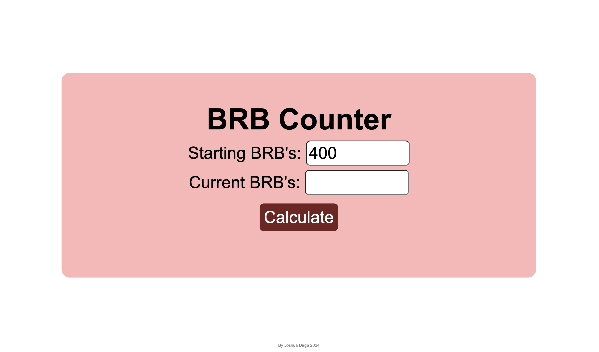

# BRB Counter

A web application to help Cornell University students track and manage their BRB (Big Red Bucks) meal plan spending throughout the semester.

## Description

BRB Counter is a simple, user-friendly tool that calculates whether you're on track with your BRB spending. It analyzes your current BRB balance against the progress of the semester to determine if you're over-spending, under-spending, or perfectly on track with your meal plan.



## Features

- Calculate semester completion percentage based on current date
- Track percentage of BRBs used
- Project ideal weekly and daily BRB spending rates
- Provide personalized feedback based on spending patterns
- Informational popup explaining calculation methodology

## Tech Stack

- HTML5
- CSS3
- Vanilla JavaScript
- Vercel for hosting and analytics

## How It Works

1. Enter your starting BRB amount (default is 400)
2. Enter your current BRB balance
3. Click "Calculate" to see:
   - Semester completion percentage
   - Percentage of BRBs used
   - Projected weekly usage
   - Projected daily usage
   - A comment suggesting whether to adjust your spending

## Installation

To run this project locally:

1. Clone the repository
   ```
   git clone https://github.com/yourusername/BRB-Counter-web.git
   ```

2. Navigate to the project directory
   ```
   cd BRB-Counter-web/BRB\ counter/
   ```

3. Open the `index.html` file in your browser
   ```
   open index.html
   ```
   
   Alternatively, you can use a simple HTTP server:
   ```
   python -m http.server
   ```
   Then visit `http://localhost:8000` in your browser.

## Contributing

Feel free to fork this repository and submit pull requests for any enhancements or bug fixes.

## Author

Developed by Joshua Dirga (2024)